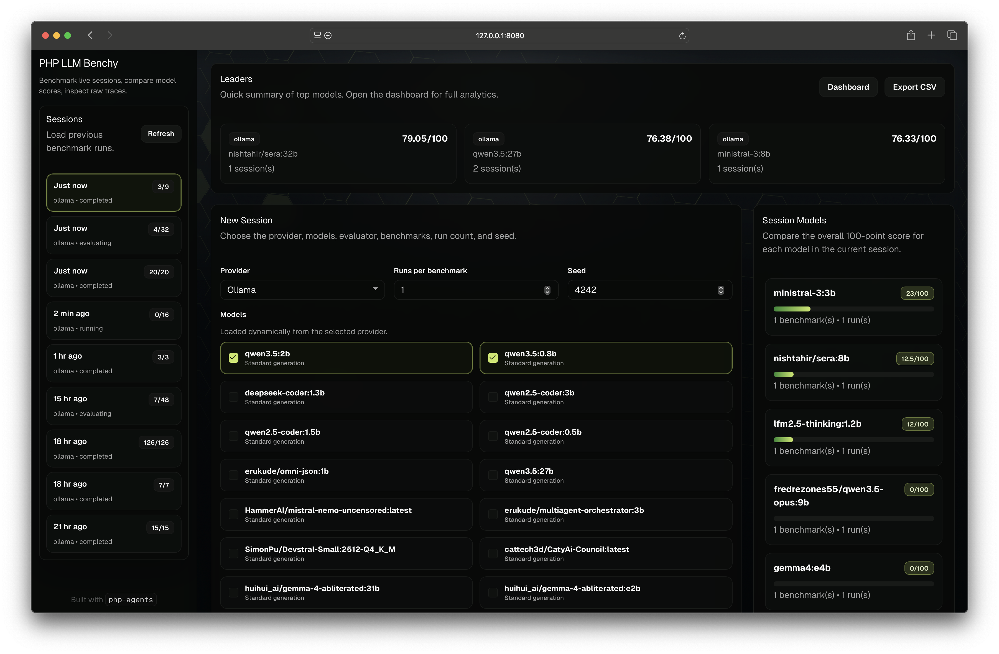

# PHP LLM Benchy

<!-- markdownlint-disable MD033 -->
<p align="center">
    <picture>
        
    </picture>
</p>

`php-llm-benchy` is a local Ollama-first benchmark workbench for comparing LLMs across tool use, memory, shell execution, PHP code generation, creative writing, and synthetic game-control tasks. It stores full run history in SQLite, streams live attempt traces to the browser, and produces definitive scores out of 100 for every attempt, benchmark, and model.

<!-- markdownlint-disable MD033 -->
<p align="center">
    <picture>
        
    </picture>
</p>

## What it does

- Creates benchmark sessions with a provider, one or more candidate models, one evaluation model, a benchmark selection, run count, and a configurable seed policy.
- Discovers models dynamically from the provider model API. v1 is wired for Ollama at `http://ollama:11434/v1`.
- Runs models sequentially, captures raw response text, reasoning deltas, and tool activity, then evaluates quality in a second pass.
- Persists sessions, attempts, stream events, benchmark averages, model rollups, and CSV export data in SQLite.
- Shows previous sessions in a sidebar, current-session model rankings in a side rail, and overall leaders across completed sessions.

## Scoring model

Each attempt is scored on a strict 100-point scale.

- Capability score: 0-50
- Quality rubric score: 0-50

The quality rubric uses five criteria scored from 0 to 10 by the evaluation model.

- Relevance
- Coherence
- Creativity
- Accuracy
- Fluency

Benchmark scores are the average of their attempts. Model scores are the average of that model's benchmark scores in the session.

## Benchmarks

V1 ships with eight benchmarks.

- Tool use
- Concurrent tool use
- Synthetic Mario speedrun
- Memory recall
- Restricted shell execution
- PHP script quality
- Creative story quality
- Poem quality

> The Mario benchmark is synthetic. It reuses php-plays-style state and control semantics, but it does not launch a real emulator or ROM.

## Seed behavior

The session form lets you choose both a seed type and a seed change frequency.

### Seed types

- Random: Benchy generates a random base seed when the session is created. The seed input is locked in the UI. If you choose `Per Test` or `Per Run`, Benchy derives different effective seeds from that random base and shows the active seed in the live console as each attempt starts.
- Fixed: You provide one explicit non-negative seed. Fixed mode always uses the same seed for the entire session, so the frequency selector is disabled.
- Iterative: You provide the starting seed. Benchy increments that value by `1` whenever the selected frequency boundary changes.

### Seed change frequency

- Per Session: One effective seed is reused for all attempts in the session.
- Per Test: A new effective seed is chosen for each model and benchmark pair. If a model runs the same benchmark twice, both runs reuse that test-level seed before Benchy advances to the next test.
- Per Run: Every individual attempt gets its own effective seed.

### Examples

- Fixed + Per Session: Seed `42` is used for every attempt in the session.
- Iterative + Per Test: Starting from `42`, the first model-and-benchmark pair uses `42`, the next pair uses `43`, then `44`, and so on.
- Iterative + Per Run: Starting from `42` with four total attempts results in `42`, `43`, `44`, and `45`.
- Random + Per Run: Benchy creates one random base seed for the session, derives a different effective seed for every run, and displays each one in the live logs.

The evaluation model stays on the stable session base seed. Candidate model attempts record the effective seed used for that attempt in both SQLite and the streamed trace events.

## Requirements

- PHP 8.4+
- Composer
- SQLite support enabled in PHP
- An Ollama-compatible endpoint available at `http://ollama:11434/v1`

## Setup

1. Install dependencies.

```bash
composer install
```

1. Copy the environment template and adjust values if needed.

```bash
cp .env.example .env
```

1. Confirm the Ollama endpoint and models you want to benchmark are available.

Example:

```bash
curl http://ollama:11434/v1/models
```

## Run locally

Start the built-in PHP server:

```bash
./bin/serve
```

Then open `http://127.0.0.1:8080`.

## Run with Docker

This project includes a lightweight Docker setup with PHP 8.4, Composer, and SQLite PDO support.

1. Copy the environment template if you have not already done so.

```bash
cp .env.example .env
```

1. Make sure Ollama is reachable from Docker.

The included `docker-compose.yml` assumes Ollama is running on your Mac host and uses `http://host.docker.internal:11434/v1` inside the container.

If your Ollama endpoint lives somewhere else, override it when starting the stack:

```bash
DOCKER_OLLAMA_BASE_URL=http://your-ollama-host:11434/v1 docker compose up --build
```

1. Build and start the container.

```bash
docker compose up --build -d
```

1. Open the app.

```text
http://127.0.0.1:8080
```

The container publishes port `8080` by default. To use another local port, set `APP_PORT` when starting Compose:

```bash
APP_PORT=8090 docker compose up --build -d
```

Runtime data is persisted in the named Docker volume `benchy_data`.
That volume stores the SQLite database, exports, and sandbox files under `/app/storage/runtime`, so data survives container restarts and recreation.

Useful commands:

```bash
docker compose logs -f app
docker compose down
docker compose down -v
```

- `docker compose down` stops the app and keeps the database volume.
- `docker compose down -v` also removes the persisted benchmark data.

## Test and analysis

Run the test suite:

```bash
composer test
```

Run static analysis:

```bash
composer analyse
```

## Notes on runtime behavior

- Model runs are sequential by design.
- Evaluation happens after raw capture so the evaluation model can stay hot.
- Full trace persistence is enabled, including tool calls, tool results, streamed text deltas, and reasoning deltas when the model emits them.
- Attempt traces include the effective seed used for each run, so live logs and stored history match the exact benchmark execution path.
- The shell benchmark is restricted to an allowlist and runs only inside the configured sandbox directory.
- The current server setup uses PHP's built-in server. It is fine for local development, but it is not intended as a production deployment target.

## Project layout

- `public/index.php`: entrypoint and HTTP router
- `public/assets/`: UI styles and browser logic
- `src/Runner/BenchmarkRunner.php`: session execution orchestration
- `src/Evaluation/ResponseEvaluator.php`: capability and rubric scoring
- `src/Repository/SessionRepository.php`: SQLite persistence API
- `src/Benchmark/BenchmarkRegistry.php`: benchmark catalog

## Current scope

This version focuses on the local single-user workflow.

- No authentication
- No multi-provider UI beyond Ollama yet
- No background job system
- No production packaging
